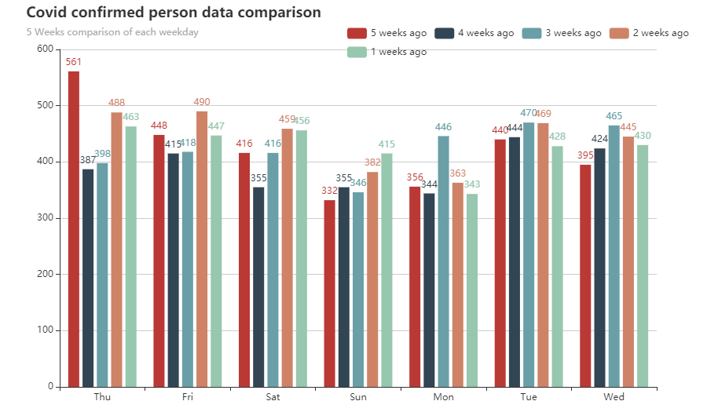

<!-- reference for the README.md: https://gist.github.com/PurpleBooth/109311bb0361f32d87a2 -->

# Corona visual server

Make a bar chart which compares `COVID-19 confirmed case` of each weekday for several weeks



## Purpose of the project

1. Desire for checking weekday comparison of the `COVID-19 confirmed case`
2. Practice Go visual chart package - [go-echarts](https://github.com/go-echarts/go-echarts)
3. Practice using an `Open API` from the government
4. Practice deploying to Heroku using GitHub Actions

## How to run locally

1. [data.go.kr](https://www.data.go.kr/data/15043376/openapi.do) 서비스 키를 발급 받으세요.
1. 서비스키가 URL_ENCODED 되어서 나오기 때문에 [urldecoder.org](https://www.urldecoder.org) 에서 DECODE 해주세요.
1.  그 다음 프로젝트 루트에서 실행하세요.
    ```shell
    SERVICE_KEY=<your_service_key> go run main.go
    ```

## Blog posting(In Korean language)

1. [공공데이터 오픈API를 신청해서 데이터 얻기](https://jusths.tistory.com/199)
2. [데이터를 먹기좋게 요리하기](https://jusths.tistory.com/200)
3. [데이터를 차트로 만들어서 웹서비스 하기](https://jusths.tistory.com/201)
4. [Heroku 에 올려서 서비스하기](https://jusths.tistory.com/202)


## Acknowledgments

Special thanks to [Mo Kweon](https://github.com/kkweon) for the great contribution. 
